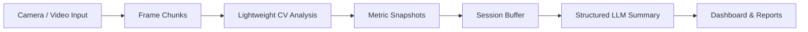

# Smart Presence Coach

**Created by Yarden Deshe**

Real-time AI-powered system for analyzing body language and improving communication skills.

## Overview

Smart Presence Coach helps people practice presentations, interviews, and high-stakes conversations by turning camera or video input into actionable feedback. The system analyzes body language signals and generates personalized insights that help users understand how they are perceived and what to improve next.

This project focuses on backend architecture, real-time computer vision processing, session data aggregation, and AI-based feedback generation.

## Tech Stack

- **Frontend:** React, TypeScript, Vite, Tailwind CSS
- **Backend:** FastAPI, Python, Pydantic, SQLAlchemy
- **AI / Computer Vision:** MediaPipe, NumPy
- **LLM Integration:** Google GenAI / Gemini API
- **Data & Reports:** SQLite, PDF report generation with WeasyPrint
- **Infrastructure:** Docker, Docker Compose

## How It Works



- **Frame Capture:** The frontend captures camera frames or uploads a recorded video.
- **Landmark Extraction:** MediaPipe extracts face, pose, and hand landmarks from each frame.
- **Metric Analysis:** The backend analyzes posture, focus, engagement, composure, and overall presence.
- **Session Aggregation:** Scores are collected over time to identify trends across the session.
- **AI Insight Generation:** Aggregated metrics are sent to the LLM to produce personalized feedback.
- **Dashboard & Reports:** The user receives live feedback, session summaries, recommendations, and exportable reports.

## Demo / Screenshots


## Getting Started

### Run With Docker

```bash
git clone https://github.com/yardenDe/SmartPresenceCoach.git
cd SmartPresenceCoach
docker compose up --build
```

`docker compose` works without an environment file using a local SQLite
database. To enable the LLM or email integrations locally, copy the example
file and fill only the values you need:

```bash
cp backend/.env.example backend/.env
```

The app will be available at:

- **Frontend:** `http://localhost:5173`
- **Backend:** `http://localhost:8000`

### Run Locally

#### Backend

```bash
cd backend
cp .env.example .env  # optional; defaults work without it
pip install -r requirements.txt
python app/main.py
```

#### Frontend

```bash
cd frontend
cp .env.example .env  # optional; the default is http://localhost:8000
npm install
npm run dev
```

### Run Backend Tests

```bash
cd backend
pytest tests/unit -v
```

The unit tests are grouped by domain under `tests/unit/` and share lightweight
MediaPipe and database fakes from `tests/config_test.py`.

## Environment Variables

`backend/.env` is optional and intended only for local development. Start from
`backend/.env.example`; all variables are optional for the local SQLite setup.
Docker Compose does not load this file. In cloud deployments, inject values as
environment variables through the hosting platform's secret/configuration
mechanism; environment values take precedence over a local `.env` file.

```env
DATABASE_URL=sqlite:///./data/sql_app.db
SECRET_KEY=your-secret-key
FRONTEND_ORIGIN=http://localhost:5173
LLM_API_KEY=your-google-genai-api-key
LLM_MODEL=gemini-3.1-flash-lite
```

For the frontend, `frontend/.env` is optional. Its only runtime setting is the
browser-visible backend URL:

```env
VITE_API_BASE_URL=http://localhost:8000
```

### Configuration ownership

| Setting | Source of truth | Why it is also mentioned elsewhere |
| --- | --- | --- |
| Backend host, port and reload | `backend/app/core/config.py` / `backend/.env` | Compose only maps port `8000` to the host and enables reload for development. |
| Frontend dev-server host and port | `frontend/vite.config.ts` | The Dockerfile runs the same `npm run dev` command as local development. |
| Frontend API URL | `frontend/.env` or `VITE_API_BASE_URL` | Compose supplies `http://localhost:8000` because this URL is used by the browser, not by one container talking to another. |
| Database files in Compose | `backend-data` Docker volume | This is needed so SQLite data survives container recreation; local runs use `backend/data/`. |

## MediaPipe Models

The computer vision pipeline expects the MediaPipe task models to exist locally at:

```text
backend/assets/mediapipe/
```

Required files:

- `face_landmarker.task`
- `pose_landmarker.task`
- `hand_landmarker.task`

These model files are versioned with the repository so live and offline analysis work after cloning.

## API Overview

- **Authentication:** user registration, login, and protected access
- **Live Analysis:** frame-by-frame analysis from the camera
- **Offline Analysis:** uploaded video processing
- **Sessions:** session lifecycle, history, and stored snapshots
- **Reports:** structured summaries and PDF report generation

## Challenges & Solutions

### Reducing API Overhead

Sending every captured frame as a separate request can create unnecessary network and API overhead. To keep communication efficient, the frontend sends visual input in small chunks, allowing the backend to process meaningful batches instead of handling every frame as an isolated request.

### Fast Feedback in the User Interface

Real-time coaching only feels useful when feedback appears close to the user's actual behavior. The system separates feedback into two layers: a real-time layer that uses a lightweight computer vision model for immediate metric updates, and an AI insight layer that generates deeper recommendations after enough session data has been collected.

### Optimized Data Pipeline

The data pipeline is designed to reduce and refine information at every stage. Instead of processing every frame, the system samples selected frames from each video batch. Those frames are converted into landmarks, and the raw frames are not stored. From the extracted landmarks, the backend keeps only the signals that are relevant for coaching. The system then calculates metrics based on those filtered landmarks, and only the calculated metric snapshots are saved. A session buffer collects these snapshots over time to reduce database transactions. Before the data is sent to the LLM, it is refined into a compact summary, reducing token usage while keeping the AI feedback focused on meaningful session patterns.

## Project Structure

```text
backend/
  app/
    api/          API routes
    analytics/    Presence metric analyzers
    services/     Business logic and orchestration
    vision/       Video and landmark processing
    db/           Database initialization
    models/       Database models
    schemas/      Request and response schemas

frontend/
  src/
    features/presence-dashboard/  Main coaching dashboard
    services/                     API clients
    context/                      Authentication context
```

